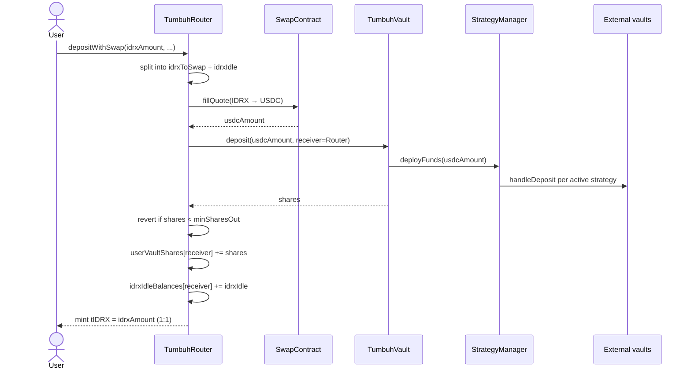

# Deposit flow

Every Tumbuh deposit goes through a single Router function: `depositWithSwap`. This page describes exactly what that function does, in order, and finishes with a fully worked numerical example.

## Entry point

```solidity
function depositWithSwap(
    uint256 idrxAmount,
    address receiver,
    uint256 minSharesOut,
    bytes calldata swapData
) external whenNotPaused nonReentrant returns (uint256 shares);
```

| Parameter | Meaning |
|---|---|
| `idrxAmount` | The total IDRX to deposit. The Router pulls this from your wallet and must have approval. |
| `receiver` | The address that owns the resulting position. tIDRX is minted here; vault shares are tracked under this address. |
| `minSharesOut` | The minimum number of vault shares you accept. The transaction reverts if the actual mint is below this. |
| `swapData` | ABI-encoded `(address swapTarget, bytes swapCallData)` from the 0x API. The `swapTarget` must equal the configured `allowanceHolder` — otherwise the SwapContract reverts. |

## Step-by-step sequence



<Steps>
  <Step title="Pull IDRX from caller">
    The Router transfers the full `idrxAmount` from `msg.sender` to itself. This requires that `msg.sender` has previously approved the Router on the IDRX token contract.
  </Step>

  <Step title="Split into swap and idle">
    The Router splits the IDRX into two portions according to its configured swap percentage:

    - `idrxToSwap = idrxAmount × swapPercentage / 10000`
    - `idrxIdle = idrxAmount − idrxToSwap`

    `swapPercentage` is bounded between **7000 bps (70%)** and **9000 bps (90%)** and can only be changed by the `ADMIN_MANAGER` role.
  </Step>

  <Step title="Swap to USDC">
    The Router approves the SwapContract for `idrxToSwap` and calls `fillQuote(IDRX, USDC, idrxToSwap, swapTarget, swapCallData)`. The SwapContract executes the swap through 0x's AllowanceHolder and returns the USDC received. It hard-rejects any `swapTarget` that is not the configured AllowanceHolder.
  </Step>

  <Step title="Deposit USDC into the Vault">
    The Router calls `vault.deposit(usdcAmount, receiver=Router)`. Note: the Router is the `receiver`, not the user. This is intentional — the Router holds vault shares on the user's behalf and tracks ownership in its own `userVaultShares` mapping.
  </Step>

  <Step title="Vault deploys funds to strategies">
    Inside `deposit`, the Vault forwards the USDC to `StrategyManager.deployFunds`. The StrategyManager allocates proportionally across active strategies:

    `strategyAmount = totalAmount × strategyPercentage / sum(activePercentages)`

    Each strategy's adapter calls the external vault's ERC-4626 `deposit` and records the shares received.
  </Step>

  <Step title="Validate slippage">
    Back in the Router, after the Vault returns the share count, the Router reverts if `shares < minSharesOut`. This protects users from quote drift between transaction submission and execution.
  </Step>

  <Step title="Update accounting and mint tIDRX">
    On success, the Router credits `userVaultShares[receiver]` with the new shares, credits `idrxIdleBalances[receiver]` with `idrxIdle`, and mints tIDRX to the receiver 1:1 with `idrxAmount`. The `DepositWithSwap` event is emitted.
  </Step>
</Steps>

## Worked example

Assume a fresh deposit of **100,000 IDRX** with `swapPercentage = 8000 bps`, market quote of `1 IDRX = 0.0009937 USDC`, and `0.5%` swap slippage. Default strategy allocations: 10% / 10% / 40% / 40%.

| Step | Value |
|---|---|
| `idrxAmount` | 100,000 IDRX |
| `idrxToSwap` (80%) | 80,000 IDRX |
| `idrxIdle` (20%) | 20,000 IDRX |
| Quoted USDC for 80,000 IDRX | 79.50 USDC |
| Actual USDC received (after 0.5% slippage) | 79.10 USDC |
| Sent to Morpho Vault 1 (10%) | 7.91 USDC |
| Sent to Morpho Vault 2 (10%) | 7.91 USDC |
| Sent to AutoFinance (40%) | 31.64 USDC |
| Sent to Avantis (40%) | 31.64 USDC |
| Vault shares minted to Router | depends on current share price |
| tIDRX minted to user | 100,000 |
| Idle IDRX held by Router for user | 20,000 |

After the transaction, the user's wallet shows 100,000 tIDRX. The vault shares — the actual yield-bearing position — are held by the Router and tracked under the user's address in `userVaultShares`.

## Slippage protection

Two slippage bounds matter on a deposit:

- **Swap slippage** — the IDRX → USDC quote can move between your submission and execution. The 0x quote includes a slippage tolerance you set when fetching it.
- **`minSharesOut`** — guards the final share count after the swap and the strategy deployment. A wallet or frontend should set this from the live `previewDeposit` quote, with a buffer.

<Tip>
Setting `minSharesOut` to about `0.5%` below the previewed share count is a reasonable default. Tighter bounds increase the chance of revert; looser bounds accept more slippage.
</Tip>

## Common pitfalls

- **Insufficient IDRX approval.** The Router's `transferFrom` will revert. Approve at least `idrxAmount` before calling `depositWithSwap`.
- **Below `minDepositAmount`.** If the `ADMIN_MANAGER` has set a minimum, deposits below it revert. Read the current value with `router.minDepositAmount()`.
- **Stale `swapData`.** 0x quotes have an expiration window. A quote older than a couple of minutes will likely revert at the swap step.
- **Paused state.** When the Router is paused, `depositWithSwap` reverts with `Pausable: paused`.
- **Wrong `swapTarget`.** The `swapTarget` inside `swapData` must equal the SwapContract's configured `allowanceHolder`. Other targets are hard-rejected.

<Warning>
A revert at the swap step still costs gas. Always fetch a fresh 0x quote immediately before sending the transaction.
</Warning>

## Related pages

- [Withdraw flow](/how-it-works/withdraw-flow) — the inverse path through `redeemWithSwap`.
- [Yield generation](/how-it-works/yield-generation) — what happens to the USDC after it lands in strategies.
- [TumbuhRouter](/protocol-architecture/tumbuh-router) — the full Router reference.
- [SwapContract](/protocol-architecture/swap-contract) — the 0x integration surface.
