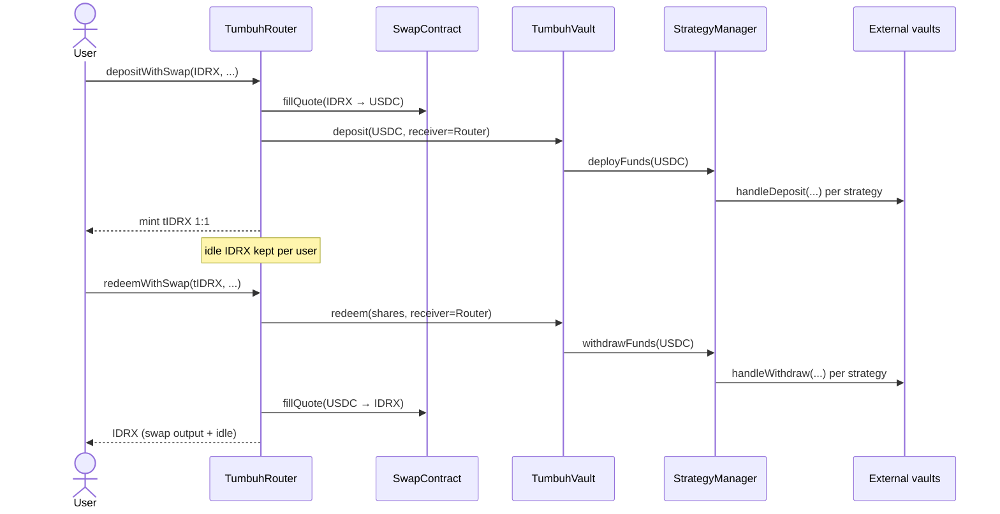
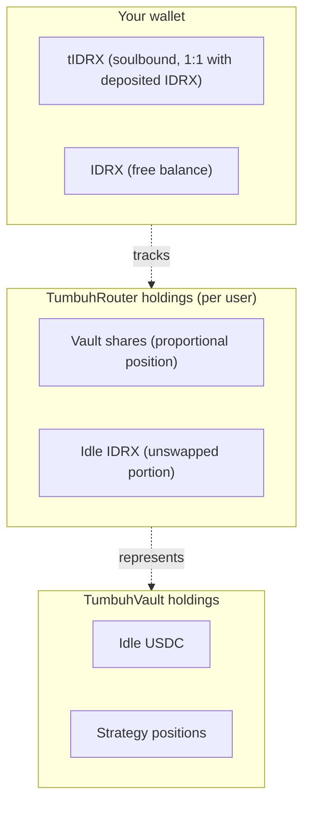

# How it works

Tumbuh is a three-step loop:

1. **Deposit.** You send IDRX. The Router swaps most of it to USDC, deposits the USDC into the Vault, and mints tIDRX back to you as a receipt.
2. **Earn.** The Vault delegates the USDC to a StrategyManager, which allocates across several ERC-4626 yield protocols. Yield raises the Vault's share price.
3. **Withdraw.** You burn tIDRX. The Router redeems the corresponding vault shares for USDC, swaps USDC back to IDRX, and sends the IDRX to you alongside the idle IDRX it kept aside on your behalf.

## The full flow

## Who holds what

The most non-obvious detail in Tumbuh is that **vault shares are held by the Router on your behalf, not in your wallet**. Your wallet holds tIDRX, which is a receipt — it never rises in balance and it never moves between addresses.

<Info>
The Router exposes `getUserVaultShares(user)` so you (or an integrator) can read the user's vault-share balance. This is the correct way to read a user's position — `vault.balanceOf(user)` returns zero, because the Router is the actual holder.
</Info>

## A worked example

A full numerical walkthrough lives on the [deposit flow](/how-it-works/deposit-flow) page. The short version:

- You deposit **100,000 IDRX**.
- With a swap percentage of 80%, the Router swaps **80,000 IDRX** to USDC and keeps **20,000 IDRX** idle on your behalf.
- The swap returns roughly **79.5 USDC** (after market slippage).
- The 79.5 USDC enters the Vault, which allocates it across active strategies — at launch, 10% to Morpho Vault 1, 10% to Morpho Vault 2, 40% to AutoFinance, 40% to Avantis.
- Your wallet now holds **100,000 tIDRX**. Your position is the vault shares held by the Router plus the 20,000 idle IDRX.

When you redeem the full 100,000 tIDRX later, the Router pulls a proportional share of vault USDC, swaps it back to IDRX, and returns the result alongside the 20,000 idle IDRX. If yield has accrued, you receive more IDRX than you deposited.

## Where to go next

- [Getting started](/how-it-works/getting-started) — the practical first-deposit walkthrough.
- [Deposit flow](/how-it-works/deposit-flow) — what `depositWithSwap` does step by step.
- [Yield generation](/how-it-works/yield-generation) — how share price rises and why your tIDRX balance does not change.
- [Withdraw flow](/how-it-works/withdraw-flow) — what `redeemWithSwap` does and how slippage isolation works.
- [Risks and disclosures](/security/risks-and-disclosures) — what to know before depositing.
