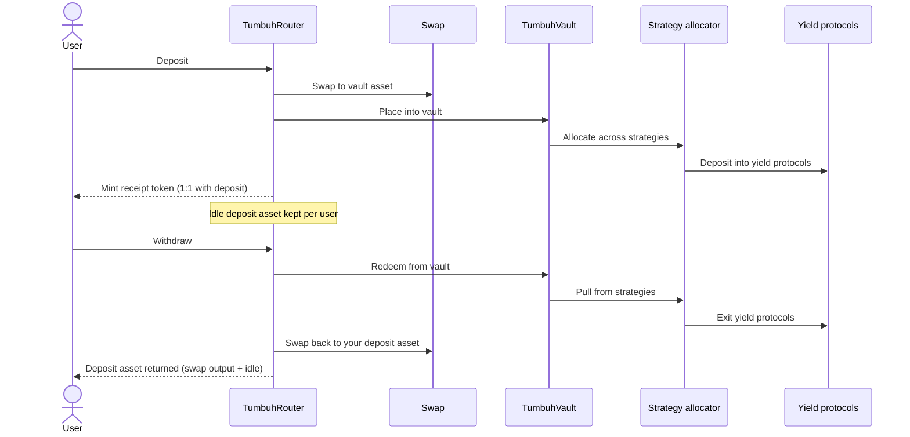
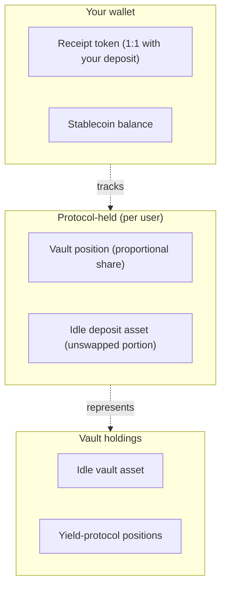

# How it works

Tumbuh is a three-step loop:

1. **Deposit.** You send your asset. The protocol swaps most of it to the vault asset, places the result into the vault, and issues your receipt token.
2. **Earn.** The vault spreads its capital across diversified DeFi yield protocols. Yield raises the vault's share value over time.
3. **Withdraw.** You burn your receipt. The protocol redeems your share of the vault, swaps the proceeds back to your asset, and sends them to you alongside the idle balance the protocol kept aside on your behalf.

## The full flow

## Who holds what

The most non-obvious detail in Tumbuh is that **your vault position is held by the protocol on your behalf, not in your wallet**. Your wallet holds the receipt token, which never changes balance and never moves between addresses.

<Info>
The web app at [app.tumbuh.fi](https://app.tumbuh.fi) reads your full position automatically — including the share of vault assets attributed to your address and any idle deposit asset held on your behalf. You do not need to read the on-chain records yourself.
</Info>

## A worked example

> *Example using IDRX as the deposit asset. Other supported deposit assets follow the same flow.*
>
> *Exchange rates fluctuate. Examples on this page use a reference rate of approximately 17,252.70 IDR/USD (April 2026); your actual amounts vary with market conditions.*

A short version (full numerical walkthrough lives on the [deposit flow](/how-it-works/deposit-flow) page):

- You deposit **100,000 IDRX**.
- With a swap portion of about 80%, the protocol swaps **80,000 IDRX** to the vault asset and keeps **20,000 IDRX** idle on your behalf.
- At a market rate of roughly 17,252.70 IDR/USD, the swap returns approximately **4.64 USDC** before slippage.
- The vault asset enters the vault and is spread across the active yield protocols.
- Your wallet now holds **100,000 tIDRX**. Your full position is the vault share held on your behalf plus the 20,000 IDRX idle balance.

When you redeem the full 100,000 tIDRX later, the protocol pulls a proportional share of the vault, swaps it back to IDRX, and returns the result alongside the 20,000 IDRX idle balance. If yield has accrued, you receive more IDRX than you deposited.

## Where to go next

- [Getting started](/how-it-works/getting-started) — the practical first-deposit walkthrough on app.tumbuh.fi.
- [Deposit flow](/how-it-works/deposit-flow) — what happens behind the scenes step by step.
- [Yield generation](/how-it-works/yield-generation) — how share value rises and why your receipt-token balance does not change.
- [Withdraw flow](/how-it-works/withdraw-flow) — how to withdraw and how slippage isolation works.
- [Risks and disclosures](/security/risks-and-disclosures) — what to know before depositing.
