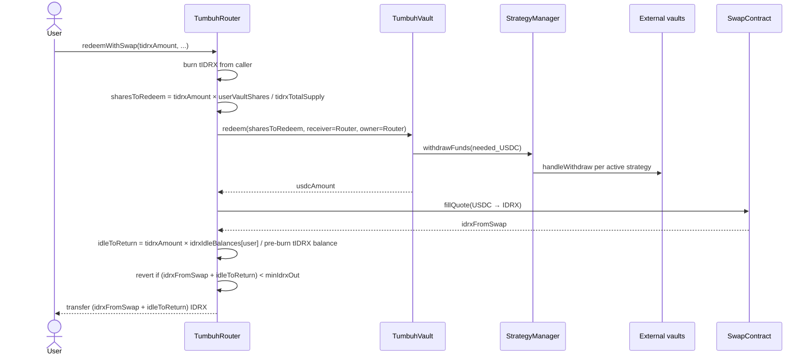

# Withdraw flow

Withdrawals go through a single Router function: `redeemWithSwap`. Burning tIDRX triggers a proportional redemption from the Vault, a USDC-to-IDRX swap, and a transfer of the resulting IDRX plus the user's idle balance.

## Entry point

```solidity
function redeemWithSwap(
    uint256 tidrxAmount,
    address receiver,
    uint256 minIdrxOut,
    bytes calldata swapData
) external whenNotPaused nonReentrant returns (uint256 idrxAmount);
```

| Parameter | Meaning |
|---|---|
| `tidrxAmount` | How much tIDRX to burn. Determines what fraction of your position is withdrawn. |
| `receiver` | The address that receives IDRX. Usually the caller. |
| `minIdrxOut` | The minimum IDRX you accept after the USDC-to-IDRX swap. The transaction reverts if actual output is below this. |
| `swapData` | ABI-encoded `(address swapTarget, bytes swapCallData)` from the 0x API for the USDC-to-IDRX leg. |

## Step-by-step sequence



<Steps>
  <Step title="Burn tIDRX">
    The Router burns `tidrxAmount` from the caller. Any further failure reverts the burn — tIDRX is not destroyed if anything downstream fails.
  </Step>

  <Step title="Compute proportional vault shares">
    Vault shares are pooled by the Router across all users. The Router computes the caller's proportional slice:

    `sharesToRedeem = tidrxAmount × userVaultShares[caller] / tidrxBalanceBeforeBurn[caller]`

    A full burn (`tidrxAmount == userBalance`) redeems all of the caller's vault shares. Partial burns redeem proportionally.
  </Step>

  <Step title="Vault redeems">
    The Router calls `vault.redeem(sharesToRedeem, receiver=Router, owner=Router)`. If the Vault's idle USDC is insufficient, it calls `StrategyManager.withdrawFunds` for the shortfall, which in turn pulls proportionally from active strategies through their adapters.
  </Step>

  <Step title="Swap USDC to IDRX">
    The Router approves the SwapContract for the received USDC and calls `fillQuote(USDC, IDRX, usdcAmount, swapTarget, swapCallData)`. As with deposits, `swapTarget` must equal the configured AllowanceHolder.
  </Step>

  <Step title="Compute idle return">
    The Router returns the caller's proportional idle IDRX:

    `idleToReturn = tidrxAmount × idrxIdleBalances[caller] / tidrxBalanceBeforeBurn[caller]`

    For a full burn, all of the caller's idle IDRX comes back. For a partial burn, only the matching fraction.
  </Step>

  <Step title="Validate slippage and transfer">
    The Router reverts if the total IDRX (`idrxFromSwap + idleToReturn`) is below `minIdrxOut`. Otherwise it transfers the IDRX to `receiver` and emits `RedeemWithSwap`.
  </Step>
</Steps>

## Slippage isolation

When the Vault redeems a strategy position, the external vault may pay out slightly less than `convertToAssets` predicts — because of withdrawal fees, exit slippage on a looped position, or rounding. Tumbuh isolates this loss to the withdrawer rather than spreading it across all holders.

**How it works.** The Vault's `redeem` returns the actual USDC received from the strategies, not the pre-call estimate. The `redeem` caller (the Router) takes whatever USDC actually came out. Because the Vault burns the caller's shares — not anyone else's — the loss reduces only the withdrawer's proceeds. Other vault holders' share price is not affected.

**A worked example.** A user with 50% of vault shares calls `redeemWithSwap` for their full position. `convertToAssets` predicts 1,000 USDC. Strategy exit slippage is 0.3%, so the Vault actually receives 997 USDC. The Router gets 997 USDC, swaps to IDRX, returns it. The remaining 50% of vault holders are unaffected — their share price is unchanged.

This is fair: the user who triggered the strategy exit pays the cost of that exit. It is also a reason to set `minIdrxOut` based on a realistic slippage assumption, not a perfect one.

## Partial withdrawals

A partial burn redeems a proportional slice of every position the user has:

- Vault shares: proportional fraction redeemed.
- Idle IDRX: proportional fraction returned.

After a partial withdrawal, the Router's accounting tracks the remaining `userVaultShares[user]` and `idrxIdleBalances[user]` for next time. There is no "all or nothing" constraint.

## Slippage protection

`minIdrxOut` is your only on-chain bound for the entire round trip. Two sources contribute to slippage:

- **External strategy exit slippage** (paid only by you — see [Slippage isolation](#slippage-isolation)).
- **USDC → IDRX swap slippage** through the 0x AllowanceHolder.

<Tip>
A wallet or frontend should fetch a fresh 0x quote, estimate strategy exit slippage based on recent activity, and set `minIdrxOut` 0.5%–1% below the combined estimate.
</Tip>

<Warning>
A `minIdrxOut` set too tight will cause the transaction to revert and you will pay gas without withdrawing. Setting it too loose accepts more slippage. There is no perfect default — review what your wallet or frontend sets before signing.
</Warning>

## A reminder on share custody

You never hold vault shares directly — the Router does, on your behalf. `redeemWithSwap` is the only way for a regular user to exit. If the Router were ever paused or replaced, redemption would require admin coordination. See [Risks and disclosures](/security/risks-and-disclosures) for the recovery runbook.

## Related pages

- [Deposit flow](/how-it-works/deposit-flow) — the inverse path.
- [Yield generation](/how-it-works/yield-generation) — what the share price is doing while you wait.
- [Fees and yield](/fees-and-yield) — performance fee and slippage isolation in depth.
- [TumbuhRouter](/protocol-architecture/tumbuh-router) — full Router reference.
