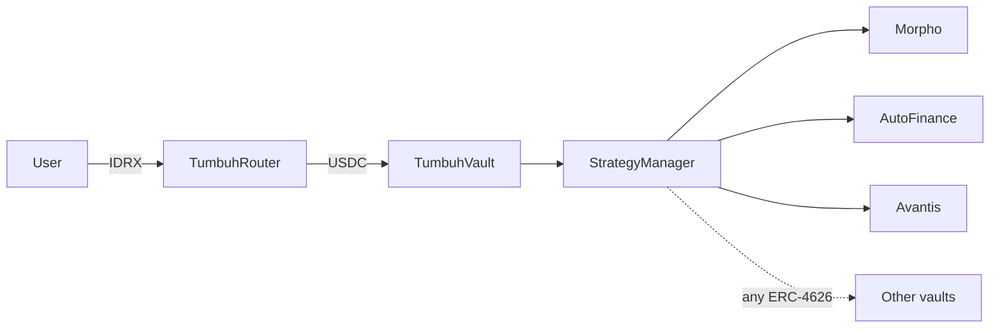

# Welcome to Tumbuh

Tumbuh is a yield aggregation vault on **Base** that lets you deposit IDRX and earn yield across multiple DeFi protocols without managing positions yourself. The protocol routes your deposit through a swap, allocates the proceeds across several ERC-4626 vaults, and pays the yield back as a steadily rising share price.

The name *tumbuh* means "to grow" in Bahasa Indonesia. Today the protocol accepts IDRX as the entry asset; the [TumbuhRouter](/protocol-architecture/tumbuh-router) is the extensibility layer for additional input assets in the future.

## What Tumbuh does

When you deposit IDRX, the Router swaps a configurable portion to **USDC** and deposits it into the [TumbuhVault](/protocol-architecture/tumbuh-vault). The vault delegates allocation to a [StrategyManager](/protocol-architecture/strategy-manager) that spreads funds across ERC-4626-compliant yield protocols — currently Morpho, AutoFinance, and Avantis. Yield accrues as the vault's share price rises. When you withdraw, your **tIDRX** receipt burns and the protocol returns IDRX equal to your proportional share of the vault.

The protocol supports any ERC-4626-compliant vault through a generic adapter, so the strategy set can grow without contract upgrades.

## Who this is for

<CardGroup cols={2}>
  <Card title="I'm a depositor" icon="user" href="/how-it-works/getting-started">
    Connect a Base wallet, deposit IDRX, earn yield, withdraw when you want.
  </Card>
  <Card title="I'm a developer" icon="code" href="/developers/integration-guide">
    Contract addresses, interface signatures, integration examples, and an adapter authoring guide.
  </Card>
</CardGroup>

## Audit status

<Warning>
Tumbuh V3 is not yet audited. Do not deposit funds you cannot afford to lose. Audit progress and known risks live on the [Risks & disclosures](/security/risks-and-disclosures) page.
</Warning>

## Where to go next

- [Getting started](/how-it-works/getting-started) — your first deposit, step by step.
- [How it works](/how-it-works/overview) — the full deposit, earn, and withdraw loop in one page.
- [Security](/security/access-control) — the role matrix, pause scope, and known risks.
- [Developers](/developers/contract-addresses) — addresses, interfaces, and integration guide.
