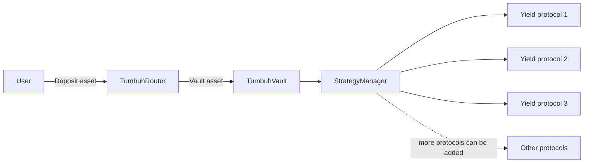

# Welcome to Tumbuh

Tumbuh is a yield aggregation vault on **Base** that lets you deposit a supported asset and earn yield across multiple DeFi protocols without managing positions yourself. The protocol routes your deposit through an automatic swap, allocates the proceeds across a diversified set of yield protocols, and pays the yield back as a steadily rising share value.

The name *tumbuh* means "to grow" in Bahasa Indonesia. The currently supported [deposit asset](/tokens/deposit-asset) is listed in the Tokens section; additional deposit assets can be added over time without changes to the underlying vault.

## What Tumbuh does

When you deposit, the protocol routes your asset through an automatic swap to the vault asset and allocates the proceeds across diversified DeFi yield protocols. Yield accrues as the vault's share value rises. When you withdraw, your receipt token burns and the protocol returns your asset equal to your proportional share of the vault — typically more than you deposited if yield has accrued.

The protocol is designed to grow its strategy set over time without contract upgrades — new yield protocols plug in through a generic adapter pattern.

## Who this is for

<CardGroup cols={2}>
  <Card title="I'm a depositor" icon="user" href="/how-it-works/getting-started">
    Connect an EVM-compatible Web3 wallet on [app.tumbuh.fi](https://app.tumbuh.fi), deposit, earn yield, withdraw when you want.
  </Card>
  <Card title="I'm a developer" icon="code" href="/developers/integration-guide">
    Contract addresses, interface signatures, integration examples, and an adapter authoring guide.
  </Card>
</CardGroup>

## Audit status

<Warning>
Tumbuh is not yet audited. Do not deposit funds you cannot afford to lose. Audit progress and known risks live on the [Risks & disclosures](/security/risks-and-disclosures) page.
</Warning>

## Where to go next

- [Getting started](/how-it-works/getting-started) — your first deposit, step by step.
- [How it works](/how-it-works) — the full deposit, earn, and withdraw loop in one page.
- [FAQ](/faq) — quick answers to common questions.
- [Security](/security/access-control) — the role matrix, pause scope, and known risks.
- [Developers](/developers/contract-addresses) — addresses, interfaces, and integration guide.
