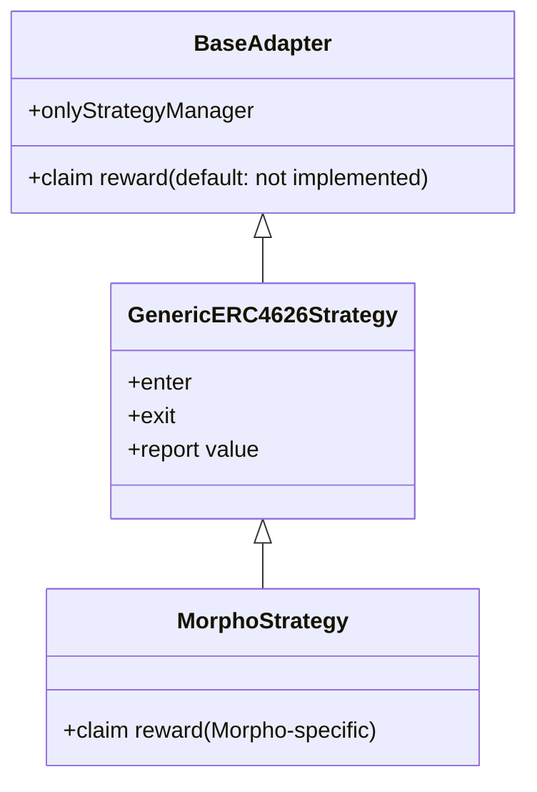

# Adapters

Adapters are the bridge between the strategy allocator and external yield protocols. Each adapter exposes a small set of methods that the allocator calls during deposit, withdraw, value-read, and reward-claim operations. Tumbuh ships two adapters today, and any ERC-4626-compliant external vault can be integrated through the generic one without writing new code.

## What every adapter exposes

Every adapter exposes the same small surface to the strategy allocator: enter the external protocol on deposit, exit the external protocol on withdrawal, report the position's current value, and (where applicable) claim reward tokens. The adapter pattern keeps the integration surface narrow; new yield protocols plug in through the same interface.

All movement methods are gated so that only the strategy allocator can call them. No other caller — including admins — can move funds through an adapter directly.

## Adapter hierarchy

`BaseAdapter` is the root abstract contract. It declares the access modifier, the upgrade hooks, and a default reward-claim method that does nothing — strategies without reward tokens inherit this and never need to override it.

## `GenericERC4626Strategy`

The generic adapter handles any vault that implements ERC-4626 cleanly. There is nothing protocol-specific about it.

| Method | Behavior |
|---|---|
| Enter | Pulls the vault asset from the strategy allocator, deposits into the external vault, returns the resulting shares. |
| Exit | Pulls the external-vault shares from the strategy allocator, redeems them, transfers the resulting vault asset back to the allocator. |
| Report value | Asks the external vault for the current vault-asset value of the held shares. |
| Claim reward | Inherits the base default — the generic adapter does not claim rewards. |

The same generic adapter contract powers multiple yield-protocol integrations — each pointed at a different external vault.

## `MorphoStrategy`

`MorphoStrategy` extends `GenericERC4626Strategy` to add Morpho-specific reward claiming. Deposit, withdraw, and value reads are inherited unchanged; only the reward-claim path is overridden to call Morpho's reward distributor.

The reward-claim path retrieves accrued reward tokens from Morpho's [Universal Rewards Distributor](/glossary#universal-rewards-distributor-urd) using a Merkle proof, transfers them to the strategy allocator, and the allocator then converts them back into the vault asset and re-deposits the result.

## Authoring a new adapter

If a protocol exposes an ERC-4626 vault and pays no extra rewards, you do not need a new adapter — register the vault as a strategy on the existing `GenericERC4626Strategy`. If a protocol pays rewards through a non-standard distributor, write a new contract that extends `GenericERC4626Strategy` and overrides the reward-claim method. Detailed walkthrough on the [adapter guide](/developers/adapter-guide) page.

## Important caveats

<Note>
**Adapters do not custody funds between calls.** Every adapter method completes its full state transition in a single call: pull tokens in, interact with the external vault, push results back. Adapters hold no idle balances.
</Note>

<Note>
**Adapters are upgradeable.** The technical detail lives in [Upgradeability](/security/upgradeability).
</Note>

## Related pages

- [StrategyManager](/protocol-architecture/strategy-manager) — the only authorized caller of adapter methods.
- [Adapter guide](/developers/adapter-guide) — developer walkthrough for authoring a new adapter contract.
