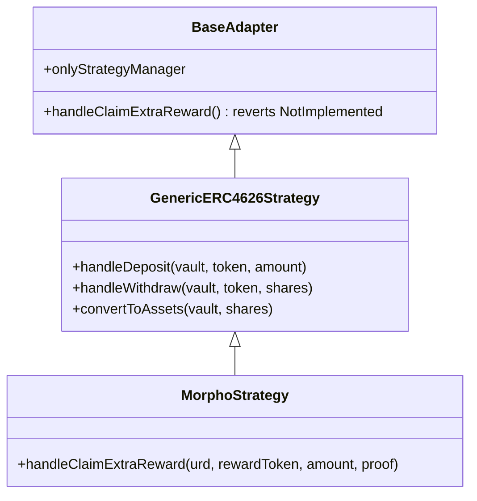

# Adapters

Adapters are the bridge between the StrategyManager and external yield protocols. Each adapter implements a small interface (`IFarmProtocolHandler`) that the StrategyManager calls during deposit, withdraw, value-read, and reward-claim operations. Tumbuh ships two adapters today, and any ERC-4626-compliant external vault can be integrated through the generic one without writing new code.

## The interface

Every adapter implements `IFarmProtocolHandler`:

```solidity
interface IFarmProtocolHandler {
    function handleDeposit(address vault, address token, uint256 amount) external returns (uint256 shares);
    function handleWithdraw(address vault, address token, uint256 shares) external returns (uint256 assets);
    function convertToAssets(address vault, uint256 shares) external view returns (uint256);
    function handleClaimExtraReward(address urd, address rewardToken, uint256 claimableAmount, bytes32[] calldata proof) external returns (uint256);
}
```

All four mutating methods are gated by **`onlyStrategyManager`** — no other caller can move funds through an adapter, including admins.

## Adapter hierarchy



`BaseAdapter` is the root abstract contract. It declares `onlyStrategyManager`, the Ownable hooks for upgrades, and a default `handleClaimExtraReward` that reverts with `NotImplemented` — strategies without reward tokens inherit this and never need to override it.

## `GenericERC4626Strategy`

The generic adapter handles any vault that implements ERC-4626 cleanly. There is nothing protocol-specific about it.

| Method | Behavior |
|---|---|
| `handleDeposit(vault, token, amount)` | Pulls `amount` of `token` from the StrategyManager, approves `vault`, calls `vault.deposit(amount, StrategyManager)`, and returns the shares received. |
| `handleWithdraw(vault, token, shares)` | Pulls `shares` of vault tokens from the StrategyManager, calls `vault.redeem(shares, adapter, adapter)`, and transfers the resulting `token` back to the StrategyManager. Returns the assets received. |
| `convertToAssets(vault, shares)` | Delegates directly to `vault.convertToAssets(shares)`. View-only. |
| `handleClaimExtraReward(...)` | Inherits the `BaseAdapter` revert — the generic adapter does not claim rewards. |

The generic adapter is a single deployment per upgrade cycle. The same deployed adapter contract powers multiple strategies pointed at different external vaults: `(GenericERC4626Strategy, AutoFinanceVault)` and `(GenericERC4626Strategy, AvantisVault)` are two distinct strategy registrations that share the adapter logic.

## `MorphoStrategy`

`MorphoStrategy` extends `GenericERC4626Strategy` to add Morpho-specific reward claiming. Deposit, withdraw, and value reads are inherited unchanged — the only override is `handleClaimExtraReward`.

```solidity
function handleClaimExtraReward(
    address urd,
    address rewardToken,
    uint256 claimableAmount,
    bytes32[] calldata proof
) external override onlyStrategyManager returns (uint256 claimedAmount);
```

The function calls `urd.claim(StrategyManager, rewardToken, claimableAmount, proof)` on Morpho's [Universal Rewards Distributor](/glossary#universal-rewards-distributor-urd). The URD verifies the Merkle proof against the latest published root and transfers `rewardToken` to the StrategyManager. The StrategyManager then swaps the reward to USDC through the SwapContract and re-deposits — see `claimAndCompound` on the [StrategyManager](/protocol-architecture/strategy-manager#reward-compounding).

## Authoring a new adapter

If a protocol exposes an ERC-4626 vault and pays no extra rewards, you do not need a new adapter — register the vault as a strategy on the existing `GenericERC4626Strategy`. If a protocol pays rewards through a non-standard distributor, write a new contract that extends `GenericERC4626Strategy` and overrides `handleClaimExtraReward`. Detailed walkthrough on the [adapter guide](/developers/adapter-guide) page.

## Important caveats

<Note>
**Adapters do not custody funds between calls.** Every adapter method completes its full state transition in a single call: pull tokens in, interact with the external vault, push results back. Adapters hold no idle balances. This keeps the trust boundary tight — a paused or compromised adapter cannot drain pre-existing balances because there are none.
</Note>

<Note>
**Adapters are upgradeable.** Each adapter is deployed behind an ERC1967Proxy, owned by a deployer-designated admin. The admin authorizes upgrades. See [Upgradeability](/security/upgradeability) for the full UUPS picture.
</Note>

## Related pages

- [StrategyManager](/protocol-architecture/strategy-manager) — the only authorized caller of adapter methods.
- [Integrations](/integrations) — current strategy set.
- [Add a new protocol](/integrations-add-new-protocol) — operational checklist for the Operator.
- [Adapter guide](/developers/adapter-guide) — developer walkthrough for authoring a new adapter contract.
