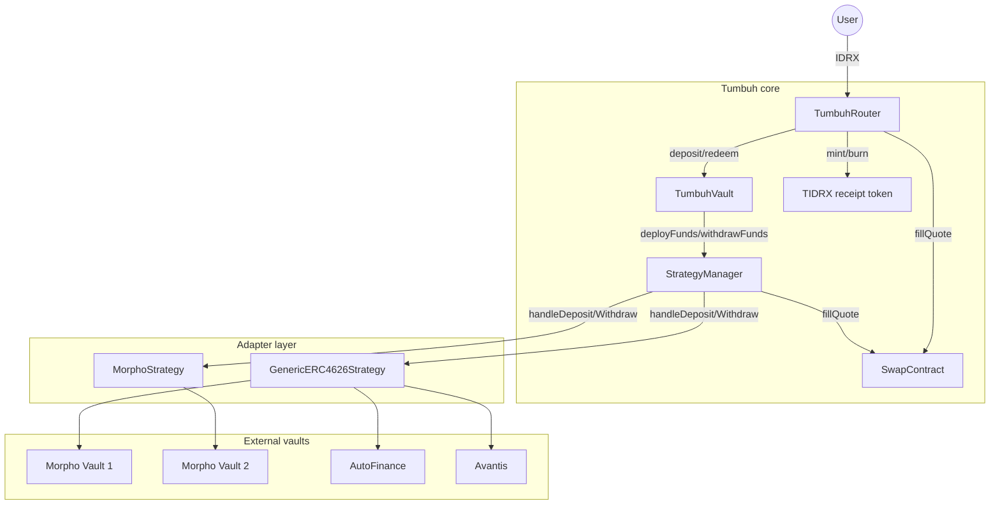

# Architecture overview

Tumbuh is composed of five core contracts plus a receipt token. Each contract has a narrow responsibility, and most cross-contract calls are gated by access modifiers that match exactly one peer.

## Component map

## Responsibility matrix

| Contract | Owns | Does not own |
|---|---|---|
| **TumbuhRouter** | IDRX user-facing entry, IDRX↔USDC swaps, per-user share and idle accounting, tIDRX mint/burn | USDC accounting, strategy allocation, fee collection |
| **TumbuhVault** | ERC-4626 share accounting in USDC, idle USDC, performance fee mints, high-watermark | IDRX, swap execution, per-user position tracking, strategy logic |
| **StrategyManager** | Strategy registry, percentage allocation, rebalance, reward compounding, emergency exits | USDC custody beyond transient pulls, performance fee, per-user positions |
| **SwapContract** | 0x AllowanceHolder calls, gated to Router and StrategyManager only | Choosing what to swap, when to swap |
| **Adapters** | Bridge calls into one external ERC-4626 vault, optional reward claiming | Allocation, scheduling, multi-vault aggregation |
| **TIDRX** | Soulbound 1:1 receipt for IDRX deposits | Yield accrual, vault share tracking |

## How the contracts connect

- The Router is the only contract a regular user interacts with. It pulls IDRX, drives the swap, deposits USDC into the Vault, and mints tIDRX.
- The Vault is the only contract authorized to call `deployFunds` and `withdrawFunds` on the StrategyManager.
- The StrategyManager is the only contract authorized to call adapter methods.
- The SwapContract is callable only by the Router and the StrategyManager — no general-purpose access.
- TIDRX is mintable and burnable only by the Router (the address is fixed at deployment and cannot change).

This narrow gating keeps the trust boundary obvious for auditors: each contract has at most one upstream caller, and unprivileged paths never reach the strategies.

## Upgrade pattern

All five core contracts are UUPS-upgradeable, with namespaced storage per [ERC-7201](https://eips.ethereum.org/EIPS/eip-7201) so storage layouts stay stable across upgrades. There is no on-chain timelock on upgrades today — see [Upgradeability](/security/upgradeability) for details and the residual risk.

## Where to go next

- [TumbuhRouter](/protocol-architecture/tumbuh-router) — the user-facing entry point.
- [TumbuhVault](/protocol-architecture/tumbuh-vault) — the ERC-4626 USDC vault.
- [StrategyManager](/protocol-architecture/strategy-manager) — allocation and rebalancing.
- [Adapters](/protocol-architecture/adapters) — how external ERC-4626 vaults plug in.
- [SwapContract](/protocol-architecture/swap-contract) — 0x integration.
- [Access control](/security/access-control) — who can call what.
