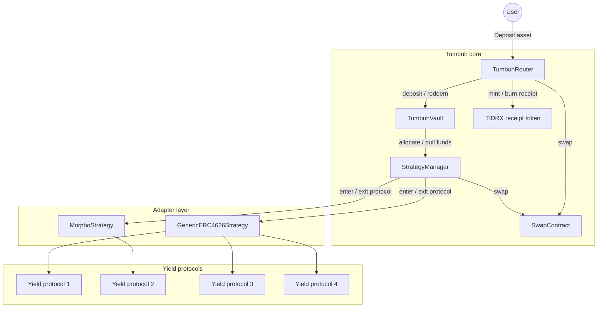

# Architecture overview

Tumbuh is composed of five core contracts plus a receipt token. Each contract has a narrow responsibility, and the calls between them are tightly scoped.

## Component map

## Responsibility matrix

| Contract | Owns | Does not own |
|---|---|---|
| **TumbuhRouter** | The user-facing entry layer; per-user position accounting; receipt-token mint and burn; deposit-asset ↔ vault-asset swaps; per-user performance fee on redemption | Vault-asset accounting; strategy allocation |
| **TumbuhVault** | The vault's value accounting; idle vault asset; share price tracking | Stablecoins other than the vault asset; swap execution; per-user position tracking; strategy logic; fee collection |
| **StrategyManager** | The strategy registry; allocation across active strategies; rebalancing; reward compounding; emergency exits | Vault-asset custody beyond transient pulls; per-user positions |
| **SwapContract** | Routing swaps through an external aggregator, gated to the router and the strategy allocator only | Choosing what to swap, when to swap |
| **Adapters** | Bridging into one external yield protocol per adapter; optional reward claiming | Allocation, scheduling, multi-protocol aggregation |
| **TIDRX** | A soulbound 1:1 receipt for deposits | Yield accrual; vault-position tracking |

## How the contracts connect

- The router is the only contract a regular user interacts with. It pulls the deposit asset from the user, drives the swap, places the result into the vault, and issues the receipt token.
- The vault is the only contract that can move capital into and out of the strategy allocator.
- The strategy allocator is the only contract that can move capital into and out of yield-protocol adapters.
- The swap layer is callable only by the router and the strategy allocator — no general-purpose access.
- The receipt token can be minted and burned only by the router (the address is fixed at deployment and cannot change).

This narrow scoping keeps the trust boundary obvious: each contract has at most one upstream caller, and unprivileged paths never reach the strategies.

## Upgrade pattern

All core contracts are upgradeable; the technical detail lives in [Upgradeability](/security/upgradeability).

## Where to go next

- [TumbuhRouter](/protocol-architecture/tumbuh-router) — the user-facing entry point.
- [TumbuhVault](/protocol-architecture/tumbuh-vault) — the vault component.
- [StrategyManager](/protocol-architecture/strategy-manager) — allocation and rebalancing.
- [Adapters](/protocol-architecture/adapters) — how external yield protocols plug in.
- [SwapContract](/protocol-architecture/swap-contract) — the swap layer.
- [Access control](/security/access-control) — who can call what.
