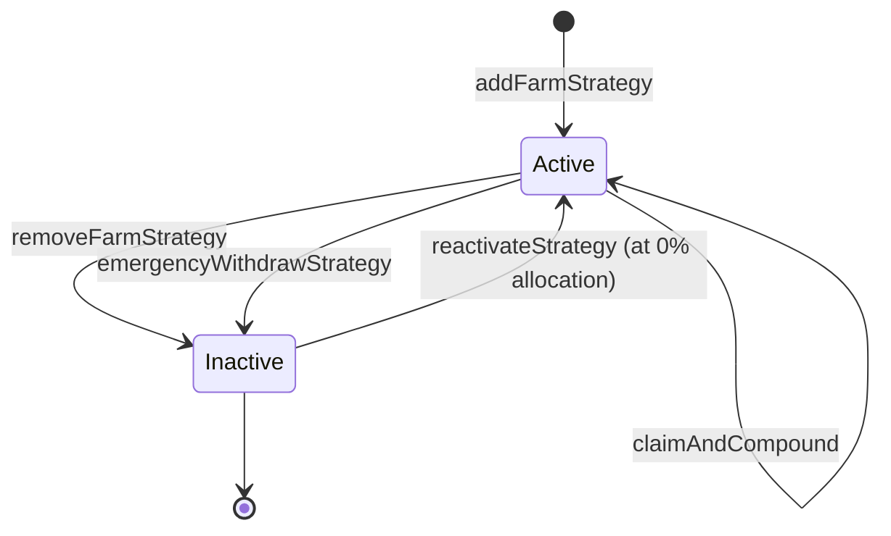

# StrategyManager

The StrategyManager is the contract that decides where the Vault's USDC goes. It maintains a registry of active strategies — each one a pair of (adapter, external vault) — and allocates capital across them according to operator-set percentages. It also drives rebalancing, reward compounding, and emergency exits.

A maximum of **10 strategies** can be active simultaneously. The sum of active percentages is capped at **10000 bps (100%)**.

## Strategy model

Each registered strategy is a `FarmStrategy` struct:

```solidity
struct FarmStrategy {
    address adapter;        // IFarmProtocolHandler implementation
    bool isActive;          // false = removed or emergency-exited
    uint16 percentage;      // target allocation in bps
    address vault;          // external ERC-4626 vault
    uint256 totalShares;    // adapter shares the StrategyManager holds
    uint256 lastKnownValue; // cached USDC value, used as fallback if convertToAssets reverts
}
```

A strategy is the union of an **adapter** (one of `GenericERC4626Strategy` or `MorphoStrategy`) and an **external vault address**. The same adapter can power multiple strategies pointed at different vaults.

## Lifecycle



A reactivated strategy comes back at **0% allocation** by default. The Operator must call `updateStrategyPercentages` after reactivation to give it a real share — until then, no new deposits flow to it.

## External functions

### Strategy registry — `OPERATOR_ROLE`

| Function | Effect |
|---|---|
| `addFarmStrategy(address adapter, address vault, uint16 percentage)` | Registers a new strategy and assigns its target percentage. Reverts if active count would exceed 10, if the (adapter, vault) pair is already registered, or if the new total percentage exceeds 10000 bps. Returns the new `strategyId`. |
| `removeFarmStrategy(uint256 strategyId)` | Withdraws all funds from the strategy, deactivates it, and redistributes the percentage budget to other active strategies. `nonReentrant`. |
| `updateFarmStrategy(uint256 strategyId, address newAdapter, address newVault)` | Withdraws from the old (adapter, vault), updates references, and re-deposits. Used when migrating to a different external vault on the same adapter. `nonReentrant`. |
| `updateStrategyPercentages(uint256[] calldata strategyIds, uint16[] calldata percentages)` | Updates per-strategy targets. Validates each ≤ 10000 bps and sum across all active strategies ≤ 10000 bps. Triggers an internal `_rebalance`. `nonReentrant`. |

### Fund management — `onlyVault`

| Function | Effect |
|---|---|
| `deployFunds(uint256 amount)` | Allocates `amount` USDC across active strategies proportionally to their percentages. Called by the Vault during `deposit`. `nonReentrant`, `whenNotPaused`. |
| `withdrawFunds(uint256 amount)` | Pulls `amount` USDC out of strategies proportionally. Called by the Vault during `redeem`. `nonReentrant`, `whenNotPaused`. |

### Rebalancing — `OPERATOR_ROLE`

| Function | Effect |
|---|---|
| `rebalance()` | Two-phase rebalance: withdraw excess from over-allocated strategies, then deposit shortfall into under-allocated ones. `nonReentrant`. |

### Reward compounding — `OPERATOR_ROLE`

```solidity
function claimAndCompound(
    uint256 strategyId,
    address urd,
    address rewardToken,
    uint256 claimableAmount,
    bytes32[] calldata proof,
    bytes calldata swapData,
    uint256 minUsdcOut
) external onlyRole(OPERATOR_ROLE) nonReentrant;
```

Claims a reward token via the strategy's adapter (Morpho's URD takes a Merkle proof), swaps the reward to USDC through the SwapContract, and deposits the resulting USDC back into the same strategy. Reverts if `usdcAmount < minUsdcOut`. Emits `RewardCompounded`.

### Emergency exits

| Function | Role | Effect |
|---|---|---|
| `emergencyWithdrawStrategy(uint256 strategyId)` | `GUARDIAN_ROLE` | Force-withdraws a strategy with `try/catch`. Resets state, deactivates the strategy, and emits `EmergencyWithdrawSuccess` or `EmergencyWithdrawFailed` depending on the outcome. Returns `lostDeposits`. `nonReentrant`. |
| `reactivateStrategy(uint256 strategyId)` | `OPERATOR_ROLE` | Re-activates a previously inactive strategy at 0% allocation. Reverts if active count would exceed 10. |

## View functions

| Function | Returns |
|---|---|
| `getFarmStrategy(uint256 strategyId)` | `StrategyInfo` — adapter, vault, totalShares, currentValue (real-time), percentage, isActive. |
| `getAllFarmStrategiesInfo()` | Array of `StrategyInfo` for all registered strategies. |
| `getTotalValueLocked()` | Sum of every active strategy's value, with fallback to `lastKnownValue` per strategy. |
| `getFarmStrategyCount()` | Total registered strategies (active + inactive). |

## Admin and pause

### `DEFAULT_ADMIN_ROLE`

| Function | Effect |
|---|---|
| `setVault(address newVault)` | Re-points the Vault reference. |
| `setSwapContract(address newSwapContract)` | Re-points the SwapContract reference. |

### `GUARDIAN_ROLE`

| Function | Effect |
|---|---|
| `pause()` | Blocks `deployFunds` and `withdrawFunds`. While paused, the Vault cannot deposit or redeem. |
| `unpause()` | Restores normal operation. |

## Events

| Event | Notes |
|---|---|
| `FarmStrategyAdded(strategyId, adapter, vault)` | New registration. |
| `FarmStrategyRemoved(strategyId)` | Strategy fully exited and deactivated. |
| `UpdateStrategy(...)` | `updateFarmStrategy` called. |
| `StrategyPercentagesUpdated(...)` | Target percentages changed. |
| `RewardCompounded(strategyId, rewardToken, urd, claimed, usdcAmount)` | Successful `claimAndCompound`. |
| `EmergencyWithdrawSuccess(strategyId, recovered)` | Emergency exit succeeded. |
| `EmergencyWithdrawFailed(strategyId)` | Emergency exit reverted; state still reset. |
| `EmergencyStrategyReset(strategyId)` | Posted after emergency state cleanup. |
| `StrategyReactivated(strategyId)` | Reactivated at 0% allocation. |

## Important caveats

<Note>
**`deployFunds` and `withdrawFunds` are gated by `onlyVault`.** No other contract — including admins — can move strategy capital. The Operator coordinates allocation by changing percentages and triggering `rebalance`; the Operator does not custody or move USDC directly.
</Note>

<Note>
**TVL has a fallback.** `getTotalValueLocked` and `totalAssets` (on the Vault) wrap each adapter's `convertToAssets` call in `try/catch`. A failing strategy returns its cached `lastKnownValue` rather than reverting the entire read.
</Note>

<Note>
**Reactivated strategies start at 0% allocation.** After `reactivateStrategy`, the operator must call `updateStrategyPercentages` to give the strategy a real share of new deposits. Until then, the strategy is registered and active but receives nothing.
</Note>

## Related pages

- [Adapters](/protocol-architecture/adapters) — how external ERC-4626 vaults plug in.
- [Pausability and emergency](/security/pausability-emergency) — the emergency-withdraw runbook.
