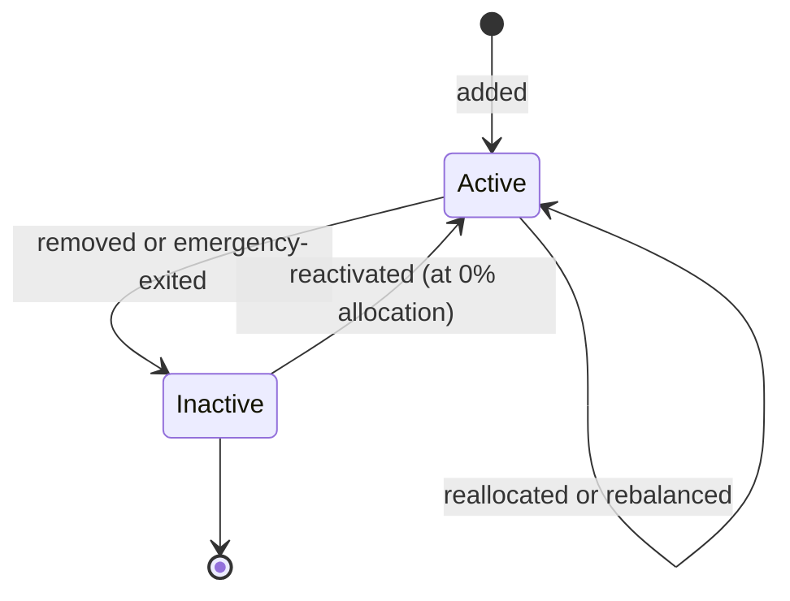

# StrategyManager

The StrategyManager is the contract that decides where the vault's capital goes. It maintains a registry of active yield protocols, allocates capital across them according to target percentages, periodically rebalances toward those targets, claims and compounds rewards from protocols that pay them, and can force-exit a misbehaving protocol in an emergency.

A maximum of **10 yield protocols** can be active at once. Allocations are capped so the active set adds up to no more than 100% of the vault's deployable capital.

## What the strategy allocator does

- Holds a registry of active yield protocols, each represented by an adapter and the external protocol's deposit address.
- On deposit, splits capital across active protocols proportionally to their target allocations.
- On redemption, pulls capital from active protocols proportionally to their share.
- Rebalances when allocations drift from targets, when a target changes, or when a protocol is added or removed.
- Claims and converts reward tokens (where the integrated protocol pays them) back into the vault asset, increasing the vault's value.
- Force-exits a protocol if the protocol's guardian role determines the integration is unsafe.

## Lifecycle

A yield protocol moves through a small set of states: it is added, it earns yield, it can be reallocated or rebalanced, and it can be removed or emergency-exited. Removed protocols can be reactivated later at zero allocation if they recover.

## Important caveats

<Note>
**Capital movement into and out of yield protocols is gated to the vault.** No one — including admins — can move strategy capital outside this path.
</Note>

<Note>
**The vault's value reading falls back to a strategy's last known value if its live value reading fails.** One unhealthy integration cannot make the whole vault unreadable.
</Note>

<Note>
**Reactivated protocols start at 0% allocation.** They must be given a real allocation before any new deposits flow to them.
</Note>

## Related pages

- [Adapters](/protocol-architecture/adapters) — how external yield protocols plug in.
- [Yield generation](/how-it-works/yield-generation) — how share value rises as the allocator earns yield.
- [Pausability and emergency](/security/pausability-emergency) — the emergency-withdraw runbook.
