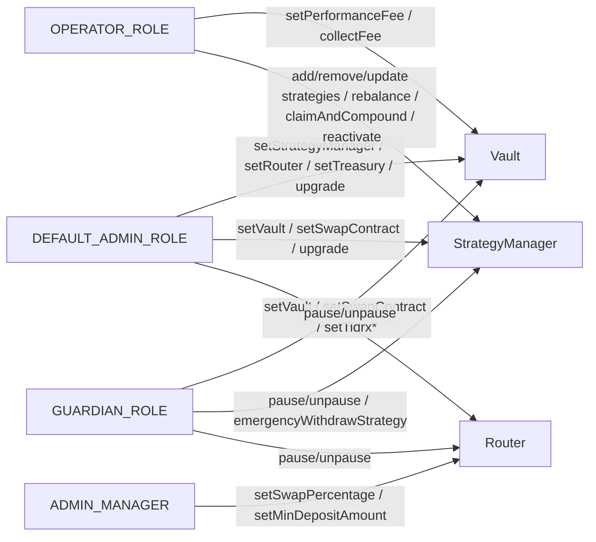

# Access control

Tumbuh uses OpenZeppelin's `AccessControl` on the three core role-bearing contracts (Router, Vault, StrategyManager) and Ownable on the SwapContract and adapters. Authority is split across four roles plus implicit caller-binding modifiers (`onlyAuthorized`, `onlyVault`, `onlyStrategyManager`, `onlyRouter`).

## Roles at a glance

| Role | Scope | What it does |
|---|---|---|
| `DEFAULT_ADMIN_ROLE` | Vault, StrategyManager, Router | Wires contracts (set Vault, set Router, set StrategyManager, set Treasury, set TIDRX one-time). Authorizes UUPS upgrades. The protocol's highest-impact role. |
| `OPERATOR_ROLE` | Vault, StrategyManager | Operational authority: collect performance fees, add/remove/update strategies, rebalance, claim and compound rewards, reactivate strategies. |
| `GUARDIAN_ROLE` | Vault, StrategyManager, Router | Pause/unpause; trigger emergency strategy withdrawal. |
| `ADMIN_MANAGER` | Router only | Tunes deposit parameters: swap percentage, minimum deposit. Distinct from `OPERATOR_ROLE` so router-config admins do not inherit vault authority. |

## Role authority diagram

`*` `setTidrx` is one-time only — once set, the call reverts on subsequent attempts even from `DEFAULT_ADMIN_ROLE`.

## Full role matrix

✓ marks an authorized role per function. Empty cells mean the role cannot call that function.

### TumbuhVault

| Function | DEFAULT_ADMIN | OPERATOR | GUARDIAN | Implicit | Timelocked? |
|---|---|---|---|---|---|
| `deposit` | ✓ | | | Router (via `onlyAuthorized`) | No |
| `redeem` | ✓ | | | Router (via `onlyAuthorized`) | No |
| `setStrategyManager` | ✓ | | | | No |
| `setRouter` | ✓ | | | | No |
| `setTreasury` | ✓ | | | | No |
| `setPerformanceFee` | | ✓ | | | No |
| `collectFee` | | ✓ | | | No |
| `pause` / `unpause` | | | ✓ | | No |
| `_authorizeUpgrade` | ✓ | | | | No |

### StrategyManager

| Function | DEFAULT_ADMIN | OPERATOR | GUARDIAN | Implicit | Timelocked? |
|---|---|---|---|---|---|
| `setVault` / `setSwapContract` | ✓ | | | | No |
| `addFarmStrategy` | | ✓ | | | No |
| `removeFarmStrategy` | | ✓ | | | No |
| `updateFarmStrategy` | | ✓ | | | No |
| `updateStrategyPercentages` | | ✓ | | | No |
| `rebalance` | | ✓ | | | No |
| `claimAndCompound` | | ✓ | | | No |
| `reactivateStrategy` | | ✓ | | | No |
| `deployFunds` / `withdrawFunds` | | | | Vault (via `onlyVault`) | No |
| `emergencyWithdrawStrategy` | | | ✓ | | No |
| `pause` / `unpause` | | | ✓ | | No |
| `_authorizeUpgrade` | ✓ | | | | No |

### TumbuhRouter

| Function | DEFAULT_ADMIN | ADMIN_MANAGER | GUARDIAN | Public | Timelocked? |
|---|---|---|---|---|---|
| `depositWithSwap` | | | | ✓ (whenNotPaused) | No |
| `redeemWithSwap` | | | | ✓ (whenNotPaused) | No |
| `setSwapPercentage` | | ✓ | | | No |
| `setMinDepositAmount` | | ✓ | | | No |
| `setVault` | ✓ | | | | No |
| `setSwapContract` | ✓ | | | | No |
| `setTidrx` (one-time) | ✓ | | | | No |
| `pause` / `unpause` | | | ✓ | | No |
| `_authorizeUpgrade` | ✓ | | | | No |

### SwapContract (Ownable)

| Function | Owner | Implicit | Timelocked? |
|---|---|---|---|
| `fillQuote` | | Router or StrategyManager (`onlyAuthorized`) | No |
| `setStrategyManager` / `setRouter` | ✓ | | No |
| `_authorizeUpgrade` | ✓ | | No |

### Adapters (Ownable)

| Function | Owner | Implicit | Timelocked? |
|---|---|---|---|
| `handleDeposit` / `handleWithdraw` / `handleClaimExtraReward` | | StrategyManager (`onlyStrategyManager`) | No |
| `_authorizeUpgrade` | ✓ | | No |

### TIDRX

| Function | Authority | Notes |
|---|---|---|
| `mint` / `burn` | Router only (immutable) | Hardcoded at deployment; cannot be reassigned. |
| Transfers | Blocked between non-zero addresses (soulbound) | Only mint and burn paths are valid. |

<Warning>
**No on-chain timelock is enforced today.** The `Timelocked?` column reads "No" everywhere. This is a known limitation tracked on the [Upgradeability](/security/upgradeability) page. Operational governance is currently the only mitigation — multisig signers and procedural delays for high-impact actions.
</Warning>

## Implicit caller-binding modifiers

Several functions cannot be called by any role directly — they are gated by *who is calling*, not *what role they hold*:

| Modifier | On contract | Allows | Used for |
|---|---|---|---|
| `onlyAuthorized` | TumbuhVault | The Router or `DEFAULT_ADMIN_ROLE` | `deposit`, `redeem` |
| `onlyVault` | StrategyManager | The TumbuhVault contract | `deployFunds`, `withdrawFunds` |
| `onlyStrategyManager` | Adapters | The StrategyManager contract | `handleDeposit`, `handleWithdraw`, `handleClaimExtraReward` |
| `onlyRouter` | TIDRX | The Router contract (immutable) | `mint`, `burn` |
| `onlyAuthorized` | SwapContract | The Router or StrategyManager | `fillQuote` |

These bindings are how Tumbuh keeps every call path narrow: the StrategyManager cannot be coerced into deploying funds without the Vault initiating, and the adapters cannot be drained without the StrategyManager initiating.

## Separation-of-duties rationale

The four roles are split intentionally:

- **`DEFAULT_ADMIN_ROLE` ≠ `OPERATOR_ROLE`.** The admin controls wiring and treasury but does not run day-to-day operations; the operator runs operations but cannot redirect the treasury or upgrade contracts.
- **`OPERATOR_ROLE` ≠ `GUARDIAN_ROLE`.** The operator can create and rebalance strategies; the guardian can pause and force-exit but cannot create or rebalance. Pausing is an emergency action that should be triggerable by a separate signer set.
- **`ADMIN_MANAGER` exists separately on the Router.** Tuning the Router's swap percentage and minimum deposit is a low-impact ops task that does not need vault-level authority. Separating it allows finer-grained delegation.
- **The SwapContract uses Ownable instead of `AccessControl`.** Single-owner is sufficient because the only configurable surface is which Router and StrategyManager to authorize. There are no operational sub-roles.

## Where to go next

- [Pausability and emergency](/security/pausability-emergency) — guardian's pause and emergency-withdraw mechanics.
- [Upgradeability](/security/upgradeability) — how upgrades work and why no on-chain timelock yet.
- [Invariants](/security/invariants) — including the `onlyVault`, `onlyStrategyManager`, and `onlyRouter` bindings.
- [Risks and disclosures](/security/risks-and-disclosures) — admin-key risk and the Router-recovery runbook.
