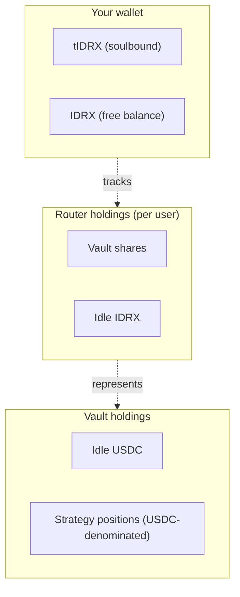

# Tokens

Three tokens are involved in a Tumbuh deposit. Only one of them — tIDRX — is issued by Tumbuh itself. The other two are external assets that Tumbuh interoperates with.



## IDRX — the entry asset

**IDRX** is a Rupiah-pegged stablecoin. It has 2 decimals and is issued and managed by an external project. Tumbuh treats IDRX as the **current entry asset**: the Router accepts IDRX, swaps the configured portion to USDC, and stores the rest as a per-user idle balance.

Tumbuh does not issue, mint, or back IDRX. For information about IDRX itself — issuance, peg mechanics, regulatory posture, supported networks — see the [IDRX project documentation](https://idrx.co/).

| Property | Value |
|---|---|
| Decimals | 2 |
| Network | Base mainnet |
| Used for | Deposits and withdrawals through the Router |

The Router is the **extensibility point for additional input assets**. The protocol does not assume IDRX is the only possible entry asset; future deployments could add other input assets through additional Router instances or upgrades, without changes to the Vault.

## USDC — the vault asset

**USDC** is the asset the Vault is denominated in. It has 6 decimals on Base. Tumbuh holds idle balances in USDC, deploys USDC to strategies, accounts for `totalAssets()` in USDC, and quotes performance fees in USDC.

| Property | Value |
|---|---|
| Decimals | 6 |
| Network | Base mainnet |
| Used for | Vault accounting, strategy allocation, fee math |

USDC is chosen because the integrated yield protocols (Morpho, AutoFinance, Avantis) all denominate in USDC. Matching them avoids per-strategy currency conversion and keeps the share-price computation simple.

You do not need to hold USDC to use Tumbuh. The Router converts IDRX to USDC for you on deposit and converts USDC back to IDRX on withdrawal.

## tIDRX — the receipt token

**tIDRX** is the only token Tumbuh itself issues. It is a **soulbound ERC-20** with 2 decimals, minted 1:1 with the gross IDRX you deposit and burned 1:1 when you redeem.

| Property | Value |
|---|---|
| Decimals | 2 |
| Transferable | No — soulbound |
| Mint and burn authority | Router only (immutable, set at deployment) |
| Total supply | Sum of every depositor's gross IDRX deposit, minus what has been redeemed |

### What tIDRX is for

tIDRX is your **receipt of deposit**, not your yield-bearing position. It identifies you as the owner of a slice of the Vault and is what you burn to withdraw. The actual yield-bearing instrument — your vault shares — is held by the Router on your behalf.

<Note>
**tIDRX is not yield-bearing.** It is neither a cToken (constant balance, rising token value) nor an aToken (rising balance, pegged value). It is a pure receipt that records how much IDRX you originally deposited. Your tIDRX balance does not change as yield accrues. You see your yield at redemption time, when your tIDRX burns for **more IDRX than you deposited**.
</Note>

### Why soulbound

Transfers between non-zero addresses are blocked at the contract level (the `_update` override reverts when both `from` and `to` are non-zero). Only **mints** (from `address(0)`) and **burns** (to `address(0)`) are allowed.

This is intentional. tIDRX is tied to the Router's per-user accounting (`userVaultShares` and `idrxIdleBalances`), not to a wallet balance alone. If tIDRX could be transferred between wallets, the receipt and the underlying position would diverge — the new holder would have tIDRX with no claim, and the original holder would have a claim with no proof. Soulbound enforcement keeps the receipt and the position bound to the same address.

### Implementation note

The Router address is **immutable** on the TIDRX contract — it is set in the constructor and cannot be changed afterward. This is a deployment-time invariant. Together with the Router's [one-time `setTidrx`](/protocol-architecture/tumbuh-router#default_admin_role), the wiring between Router and TIDRX is fixed for the lifetime of the contract.

## Reading your position

Because tIDRX does not reflect yield, you cannot read your USDC-equivalent value from your wallet alone. To estimate your current value:

```
shares = router.getUserVaultShares(your_address)       // your vault shares
usdc   = vault.convertToAssets(shares)                 // their USDC value
idrx   = quote(usdc, USDC → IDRX)                      // off-chain via 0x
total  = idrx + router.getIdleBalance(your_address)    // plus your idle IDRX
```

A wallet or frontend usually packages this into a single "estimated value" number. See [Yield generation](/how-it-works/yield-generation) for the full picture.

## Related pages

- [Getting started](/how-it-works/getting-started) — your first deposit.
- [TumbuhRouter](/protocol-architecture/tumbuh-router) — `userVaultShares` and `idrxIdleBalances`.
- [TumbuhVault](/protocol-architecture/tumbuh-vault) — vault share accounting.
- [Yield generation](/how-it-works/yield-generation) — why the tIDRX balance is flat while value rises.
