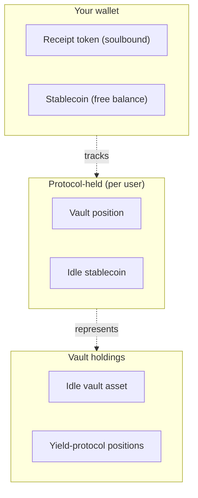

# Tokens

Three tokens are involved in a Tumbuh deposit. Only one of them — your receipt token — is issued by Tumbuh itself. The others are external assets the protocol interoperates with.

## IDRX — the entry asset (current)

**IDRX** is the current entry stablecoin, issued and managed by an external project. Tumbuh treats it as the **current entry asset**: the protocol accepts IDRX, swaps the configured portion to the vault asset, and stores the rest as a per-user idle balance.

Tumbuh does not issue, mint, or back IDRX. For information about IDRX itself — issuance, peg mechanics, regulatory posture, supported networks — see the [IDRX project documentation](https://idrx.co/).

| Property | Value |
|---|---|
| Decimals | 2 |
| Network | Base mainnet |
| Used for | Deposits and withdrawals through the protocol |

The protocol is designed to support additional entry stablecoins over time, without changes to the underlying vault.

## USDC — the vault asset (current)

**USDC** is the asset the vault is currently denominated in. It has 6 decimals on Base. Tumbuh holds idle balances in the vault asset, deploys it to yield protocols, and accounts for the vault's value in this asset.

| Property | Value |
|---|---|
| Decimals | 6 |
| Network | Base mainnet |
| Used for | Vault accounting and yield-protocol allocation |

USDC is chosen to match the denomination of the integrated yield protocols. As the protocol adds vaults with different denominations in the future, this page will list the current asset for each.

You do not need to hold USDC to use Tumbuh. The protocol converts your stablecoin to the vault asset for you on deposit and converts it back on withdrawal.

## tIDRX — the receipt token

**tIDRX** is the only token Tumbuh itself issues. It is your **receipt token** — soulbound, 2 decimals, minted 1:1 with the gross stablecoin amount you deposit and burned 1:1 when you redeem.

| Property | Value |
|---|---|
| Decimals | 2 |
| Transferable | No — soulbound |
| Issued by | the Tumbuh protocol |
| Total supply | Sum of every depositor's gross deposit, minus what has been redeemed |

### What tIDRX is for

tIDRX is your **receipt of deposit**, not your yield-bearing position. It identifies you as the owner of a slice of the vault and is what you burn to withdraw. The actual yield-bearing instrument — your vault position — is held by the protocol on your behalf.

<Note>
**The receipt token is not yield-bearing.** It is a pure receipt that records how much stablecoin you originally deposited. Your tIDRX balance does not change as yield accrues. You see your yield at redemption time, when your tIDRX burns for **more stablecoin than you deposited**.
</Note>

### Why soulbound

Transfers between non-zero addresses are blocked at the contract level. Only mints (from `address(0)`) and burns (to `address(0)`) are allowed.

This is intentional. The receipt token is tied to the protocol's per-user records, not to a wallet balance alone. If receipts could be transferred between wallets, the receipt and the underlying position would diverge — the new holder would have a receipt with no claim, and the original holder would have a claim with no proof. Soulbound enforcement keeps the receipt and the position bound to the same address.

## Reading your position

Because the receipt token does not reflect yield, you cannot read your vault-asset-equivalent value from your wallet alone. The web app at [app.tumbuh.fi](https://app.tumbuh.fi) reads the vault and the protocol's per-user records to show your current value in your stablecoin terms.

## Related pages

- [Getting started](/how-it-works/getting-started) — your first deposit on app.tumbuh.fi.
- [TumbuhRouter](/protocol-architecture/tumbuh-router) — the protocol's entry layer.
- [TumbuhVault](/protocol-architecture/tumbuh-vault) — the vault component.
- [Yield generation](/how-it-works/yield-generation) — why the receipt-token balance is flat while value rises.
